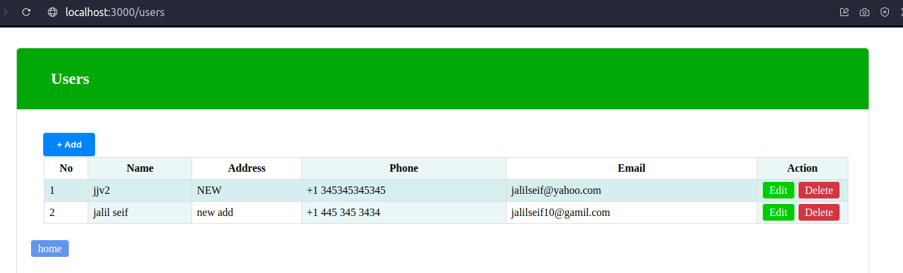
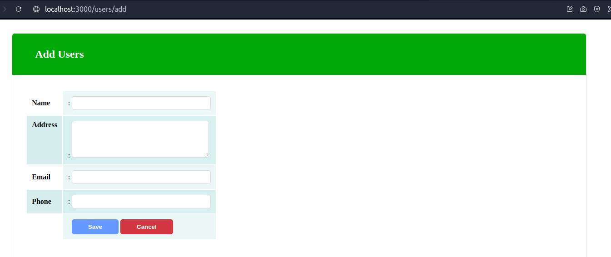

# nodejsWithCassandra
simple app for CRUD App with Nodejs and Cassandra DB

# first step
 you to install cassandra DB. this is installation way for ubuntu

echo "deb https://debian.cassandra.apache.org 41x main" | sudo tee -a /etc/apt/sources.list.d/cassandra.sources.list

curl https://downloads.apache.org/cassandra/KEYS | sudo apt-key add -

sudo apt-get update -y

sudo apt-get install cassandra -y

the main connection link for node and cassandra is: 127.0.0.1:9042

# second step
npm install

node app.js

# App images

main page

add user page

edit user page
